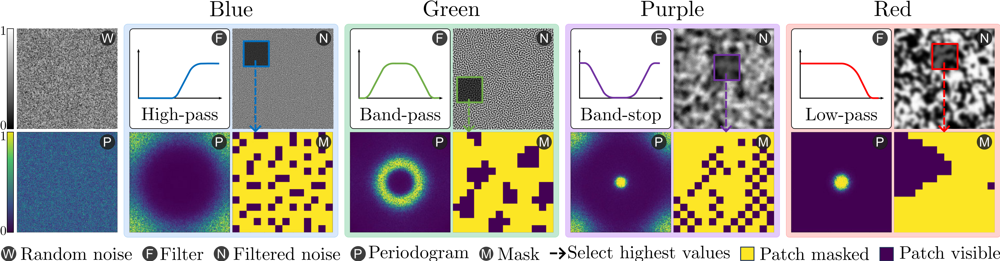

# ColorMAE: Exploring data-independent masking strategies in Masked AutoEncoders

**[Image and Video Understanding Lab, AI Initiative, KAUST](https://ivul.kaust.edu.sa/)**

<blockquote>
<p align="center">
  <a href="https://carloshinojosa.me/">Carlos Hinojosa</a>, 
  <a href="https://sming256.github.io/">Shuming Liu</a>, 
  <a href="https://www.bernardghanem.com/">Bernard Ghanem</a>
  </p>
</blockquote>



<blockquote>
<p align="center">
  <a href="https://carloshinojosa.me/files/ColorMAE.pdf"><code>Paper</code></a> · 
  <a href="https://carloshinojosa.me/files/ColorMAE_Supp.pdf"><code>Supplementary Material</code></a> · 
  <a href="https://carloshinojosa.me/project/colormae/"><code>Project</code></a> ·
  <a href="#how-to-cite"><code>BibTeX</code></a>
  </p>
</blockquote>


>Can we enhance MAE performance beyond random masking without relying on input data or incurring additional computational costs?

We introduce ColorMAE, a simple yet effective **data-independent** method which generates different binary mask patterns by filtering random noise. Drawing inspiration from color noise in image processing, we explore four types of filters to yield mask patterns with different spatial and semantic priors. ColorMAE requires no additional learnable parameters or computational overhead in the network, yet it significantly enhances the learned representations.

## Installation
To get started with ColorMAE, follow these steps to set up the required environment and dependencies. This guide will walk you through creating a Conda environment, installing necessary packages, and setting up the project for use.

1. Clone our repo to your local machine
```bash
git clone https://github.com/carlosh93/ColorMAE.git
cd ColorMAE
```
2. Create conda environment with python 3.10.12 
```bash
conda create --prefix ./venv python=3.10.12 -y
conda activate ./venv
```
3. Install Pytorch 2.0.1 and mmpretrain 1.0.2:
```bash
conda install pytorch==2.0.1 torchvision==0.15.2 torchaudio==2.0.2 pytorch-cuda=11.8 -c pytorch -c nvidia -y

pip install -U openmim && mim install mmpretrain==1.0.2 mmengine==0.8.4 mmcv==2.0.1
```

Note: You can install mmpretrain as a Python package (using the above commands) or from source (see [here](https://mmpretrain.readthedocs.io/en/latest/get_started.html#installation)).

<!-- 4. `mim install mmengine==0.8.4` -->
<!-- 5. `pip install yapf==0.40.1` -->

## Getting Started

### Setup Environment

At first, add the current folder to `PYTHONPATH`, so that Python can find your code. Run command in the current directory to add it.

> Note: Please run it every time after you opened a new shell.

```shell
export PYTHONPATH=`pwd`:$PYTHONPATH
```

### Data Preparation

Prepare the ImageNet-2012 dataset according to the [instruction](https://mmpretrain.readthedocs.io/en/latest/user_guides/dataset_prepare.html#imagenet). We provide a script and step by step guide [here](data/README.md).

### Download Color Noise Patterns
The following table provides the color noise patterns used in the paper

| Color Noise | Description | Link | Md5 |
|---------------------|-------------|---------------|---------------| 
| Green Noise         | Mid-frequency component of noise. | [Download](https://osf.io/d6k5w) | `a76e71` |
| Blue Noise          | High-frequency component of noise. | [Download](https://osf.io/fpq4n) | `ca6445` |
| Purple Noise          | Noise with only high and low-frequency content. | [Download](https://osf.io/fb9md) | `590c8f` |
| Red Noise         | Low-frequency component of noise. | [Download](https://osf.io/m862s) | `1dbcaa` |

You can download these pre-generated color noise patterns and place them in the corresponding folder inside `noise_colors` directory of the project.


## Models and results

In the following tables we provide the pretrained and finetuned models with their corresponding results presented in the paper.

### Pretrained models

| Model                                           | Params (M) | Flops (G) |                           Config                           |                                   Download                                   |
| :---------------------------------------------- | :--------: | :-------: | :--------------------------------------------------------: | :--------------------------------------------------------------------------: |
| `colormae_vit-base-p16_8xb512-amp-coslr-300e_in1k.py`   |   111.91   |   16.87   |  [config](configs/colormae_vit-base-p16_8xb512-amp-coslr-300e_in1k.py)  | [model](https://osf.io/9ck2v) \| [log](logs/pretrain/300e/colormae-green_300e_scalars.json) |
| `colormae_vit-base-p16_8xb512-amp-coslr-800e_in1k.py`   |   111.91   |   16.87   |  [config](configs/colormae_vit-base-p16_8xb512-amp-coslr-800e_in1k.py)  | [model](https://osf.io/9vpby) \| [log](logs/pretrain/800e/colormae-green_800e_scalars.json) |
| `colormae_vit-base-p16_8xb512-amp-coslr-1600e_in1k.py`   |   111.91   |   16.87   |  [config](configs/colormae_vit-base-p16_8xb512-amp-coslr-1600e_in1k.py)  | [model](https://osf.io/qbwk4) \| [log](logs/pretrain/1600e/colormae-green_1600e_scalars.json) |


### Image Classification on ImageNet-1k

| Model                                     |                   Pretrain                   | Params (M) | Flops (G) | Top-1 (%) |                   Config                   |                   Download                    |
| :---------------------------------------- | :------------------------------------------: | :--------: | :-------: | :-------: | :----------------------------------------: | :-------------------------------------------: |
| `vit-base-p16_colormae-green-300e-pre_8xb128-coslr-100e_in1k` | [ColorMAE-G 300-Epochs](https://osf.io/9ck2v) |   86.57    |   17.58   |   83.01  | [config](benchmarks/image_classification/configs/vit-base-p16_8xb128-coslr-100e_in1k.py) |                     [model](https://osf.io/yrwtp) \| [log](logs/benchmarks/image_classification/300e/vit-base-colormae-green-300e_scalars.json)                      |
| `vit-base-p16_colormae-green-800e-pre_8xb128-coslr-100e_in1k` | [ColorMAE-G 800-Epochs](https://osf.io/9vpby) |   86.57    |   17.58   |   83.61   | [config](benchmarks/image_classification/configs/vit-base-p16_8xb128-coslr-100e_in1k.py) |                      [model](https://osf.io/vptza) \| [log](logs/benchmarks/image_classification/800e/vit-base-colormae-green-800e_scalars.json)                      |
| `vit-base-p16_colormae-green-1600e-pre_8xb128-coslr-100e_in1k` | [ColorMAE-G 1600-Epochs](https://osf.io/qbwk4) |   86.57    |   17.58   |   83.77   | [config](benchmarks/image_classification/configs/vit-base-p16_8xb128-coslr-100e_in1k.py) |                      [model](https://osf.io/43x9z) \| [log](logs/benchmarks/image_classification/1600e/vit-base-colormae-green-1600e_scalars.json)                      |
<!-- TODO: Linear Probing Results -->

### Semantic Segmentation on ADE20K

| Model                                     |                   Pretrain                   | Params (M) | Flops (G) | mIoU (%) |                   Config                   |                   Download                    |
| :---------------------------------------- | :------------------------------------------: | :--------: | :-------: | :-------: | :----------------------------------------: | :-------------------------------------------: |
| `name` | [ColorMAE-G 300-Epochs](https://) |   xx.xx    |   xx.xx   |   45.80   | [config](benchmarks/segmentation/configs/xx.py) |                      N/A                      |
| `name` | [ColorMAE-G 800-Epochs](https://) |   xx.xx    |   xx.xx   |   49.18   | [config](benchmarks/segmentation/configs/xx2.py) |                      N/A                      |

### Object Detection on COCO

| Model                                     |                   Pretrain                   | Params (M) | Flops (G) | $AP^{bbox}$ (%) |                   Config                   |                   Download                    |
| :---------------------------------------- | :------------------------------------------: | :--------: | :-------: | :-------: | :----------------------------------------: | :-------------------------------------------: |
| `name` | [ColorMAE-G 300-Epochs](https:) |   xx.xx    |   xx.xx   |   48.70   | [config](benchmarks/object_detection/configs/xx.py) |                      N/A                      |
| `name` | [ColorMAE-G 800-Epochs](https://) |   xx.xx    |   xx.xx   |   49.50   | [config](benchmarks/object_detection/configs/xx2.py) |                      N/A                      |

### Using the Models

**Predict image**

Download the `vit-base-p16_colormae-green-300e-pre_8xb128-coslr-100e_in1k.pth` [**pretrained classification model**](https://osf.io/yrwtp) and place it inside the `pretrained` folder, then run:
```python
from mmpretrain import ImageClassificationInferencer

image = 'https://github.com/open-mmlab/mmpretrain/raw/main/demo/demo.JPEG'
config = 'benchmarks/image_classification/configs/vit-base-p16_8xb128-coslr-100e_in1k.py'
checkpoint = 'pretrained/vit-base-p16_colormae-green-300e-pre_8xb128-coslr-100e_in1k.pth'
inferencer = ImageClassificationInferencer(model=config, pretrained=checkpoint, device='cuda')
result = inferencer(image)[0]
print(result['pred_class'])
print(result['pred_score'])
```

**Use the pretrained model**

Also, you can use the [**pretrained ColorMAE model**](https://osf.io/9ck2v) to extract features.
```python
import torch
from mmpretrain import get_model

config = "configs/colormae_vit-base-p16_8xb512-amp-coslr-300e_in1k.py"
checkpoint = "pretrained/colormae-green-epoch_300.pth"
model = get_model(model=config, pretrained=checkpoint)
inputs = torch.rand(1, 3, 224, 224)
out = model(inputs)
print(type(out))
# To extract features.
feats = model.extract_feat(inputs)
print(type(feats))
```

## Pretraining Instructions

We use mmpretrain for pretraining the models similar to [MAE](https://github.com/open-mmlab/mmpretrain/tree/main/configs/mae). Please refer here for the instructions: [PRETRAIN.md](PRETRAIN.md).

## Finetuning Instructions
We evaluate transfer learning performance using our pre-trained ColorMAE models on different datasets and downstream tasks including: [Image Classification](benchmarks/image_classification/FINETUNE.md), [Semantic Segmentation](benchmarks/segmentation/FINETUNE.md), and [Object Detection](benchmarks/object_detection/FINETUNE.md). Please refer to the `FINETUNE.md` file in the corresponding folder.

## Acknowledgments

- Our code is based on the MAE implementation of the mmpretrain project: https://github.com/open-mmlab/mmpretrain/tree/main/configs/mae. We thank all contributors from [MMPreTrain](https://github.com/open-mmlab/mmpretrain), [MMSegmentation](https://github.com/open-mmlab/mmsegmentation), and [MMDetection](https://github.com/open-mmlab/mmdetection).
- This work was supported by the KAUST Center of Excellence on **GenAI** under award number **5940**.

<!-- How to Cite -->
## How to cite

If you use our code or models in your research, please cite our work as follows:

```Latex
@article{hinojosa2024colormae,
  title={ColorMAE: Exploring data-independent masking strategies in Masked AutoEncoders},
  author={Hinojosa, Carlos and Liu, Shuming and Ghanem, Bernard},
  journal={arXiv preprint arXiv:2407.13036},
  url={https://arxiv.org/pdf/2407.13036}
  year={2024}
}
```

## Troubleshooting

### CuDNN Warning

If you encounter the following warning at the beginning of pretraining:
```text
UserWarning: Applied workaround for CuDNN issue, install nvrtc.so (Triggered internally at /opt/conda/conda-bld/pytorch_1682343995026/work/aten/src/ATen/native/cudnn/Conv_v8.cpp:80.)
  return F.conv2d(input, weight, bias, self.stride,
```
**Solution:** This warning indicates a missing or incorrectly linked nvrtc.so library in your environment. To resolve this issue, create a symbolic link to the appropriate libnvrtc.so file. Follow these steps:
1. Navigate to the library directory of your virtual environment:
```bash
cd venv/lib/  # Adjust the path if your environment is located elsewhere
```
2. Create a symbolic link to libnvrtc.so.11.8.89:
```bash
ln -sfn libnvrtc.so.11.8.89 libnvrtc.so
```